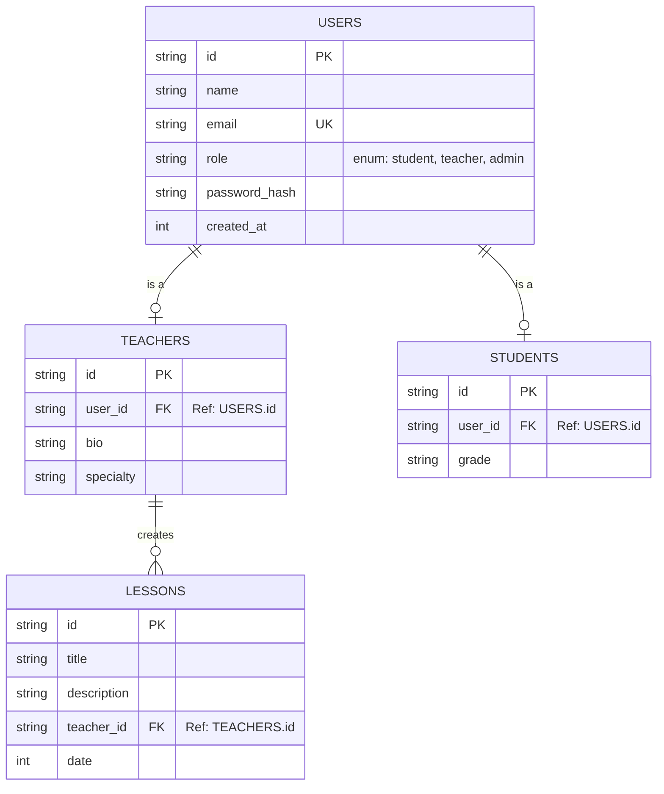

<div align="center">
  <h1>🎓 Al-Baraa Educational Platform</h1>
  <p><strong>A Next-Generation, Serverless Full-Stack Educational Dashboard</strong></p>
  
  [](https://reactjs.org/)
  [](https://vitejs.dev/)
  [](https://www.typescriptlang.org/)
  [](https://tailwindcss.com/)
  [](https://pages.cloudflare.com/)
  
  <p>
    <a href="https://al-baraa-platform.pages.dev"><strong>View Live Deployment »</strong></a>
  </p>
</div>

---

## 📖 Table of Contents
1. [Overview](#-overview)
2. [Architecture & Tech Stack](#-architecture--tech-stack)
3. [Database Design (ER Diagram)](#-database-design)
4. [API Reference](#-api-reference)
5. [Project Structure](#-project-structure)
6. [Local Development](#-local-development)
7. [Cloudflare Deployment via CLI](#-cloudflare-deployment-via-cli)

---

## 🌟 Overview

The **Al-Baraa Educational Platform** is a highly scalable, role-based educational dashboard designed for modern institutions. It serves three primary user personas:
- **🧑‍🎓 Students**: Can view their grades, upcoming lessons, and teacher feedback.
- **👩‍🏫 Teachers**: Can manage their lessons, students, and broadcast messages.
- **🛡️ Administrators**: Have total oversight over the platform's users, infrastructure, and analytics.

By leveraging **Cloudflare Pages**, the platform achieves sub-50ms latency globally without the need to manage traditional servers.

---

## 🏗 Architecture & Tech Stack

The platform is split into a highly optimized frontend and a serverless API backend, living in the same repository.

### Frontend
- **Framework**: [React 18](https://react.dev/) via [Vite](https://vitejs.dev/) for instant HMR and optimized builds.
- **Data Fetching**: [TanStack Query (React Query)](https://tanstack.com/query/v5) for caching, background updates, and optimistic UI.
- **Styling**: [Tailwind CSS](https://tailwindcss.com/) with [shadcn/ui](https://ui.shadcn.com/) for beautiful, accessible, and unstyled Radix primitives.
- **Routing**: `react-router-dom` v6 for protected routes and role-based access control.

### Backend (Serverless)
- **API Runtime**: Cloudflare Pages Functions (Edge computing).
- **Database**: [Cloudflare D1](https://developers.cloudflare.com/d1/) - Serverless SQLite built on durable objects.
- **ORM**: [Drizzle ORM](https://orm.drizzle.team/) - Lightweight, type-safe SQL wrapper for TypeScript.

---

## 🗄 Database Design

The database is built on SQLite (Cloudflare D1) and normalized for high read performance.



---

## 🔌 API Reference

The backend exposes RESTful endpoints living on the Cloudflare Edge network (`/api/*`).

### `POST /api/auth`
Authenticates a user and returns a session token.
- **Body**: `{ "email": "admin@example.com", "password": "password" }`
- **Response**: `{ "user": { "id": "u1", "role": "admin" }, "token": "..." }`

### `GET /api/users`
Retrieves all users on the platform. Requires Admin permissions.
- **Response**: `[{ "id": "u1", "name": "Admin User", "email": "admin@example.com", "role": "admin" }]`

### `GET /api/lessons`
Fetches the global lesson timeline.
- **Response**: `[{ "id": "l1", "title": "Algebra Basics", "teacher_id": "t1", "date": 1670000000000 }]`

---

## 📁 Project Structure

```text
├── functions/             # Cloudflare Edge API Functions
│   └── api/               # Maps to /api/* routes
│       ├── auth.ts        # Login endpoint
│       ├── lessons.ts     # Lessons endpoints
│       └── users.ts       # Users endpoints
├── src/                   # React Frontend Source
│   ├── components/        # Reusable UI components (shadcn/ui)
│   ├── contexts/          # React Contexts (AuthContext)
│   ├── db/                # Drizzle ORM Schema definitions
│   ├── pages/             # Route-level Page Components
│   └── main.tsx           # React mounting point & QueryClient Provider
├── schema.sql             # Raw SQLite initialization script
├── drizzle.config.ts      # Drizzle ORM CLI configuration
└── wrangler.toml          # Cloudflare deployment configuration
```

---

## 💻 Local Development

1. **Install dependencies**:
   ```bash
   pnpm install
   ```

2. **Initialize Local Database**:
   ```bash
   npx wrangler d1 execute al-baraa-db --local --file=./schema.sql
   ```

3. **Run the Development Server**:
   ```bash
   pnpm dev
   ```
   Open `http://localhost:5173` to view the app locally.

---

## ☁️ Cloudflare Deployment via CLI

To deploy this application to Cloudflare Pages from your local CLI, you need the Cloudflare Wrangler CLI.

1. **Login to Cloudflare via CLI**:
   ```bash
   npx wrangler login
   ```
2. **Provision the Production Database**:
   ```bash
   npx wrangler d1 create al-baraa-db
   ```
   *Note: This command will output a `database_id`. Copy it into the `wrangler.toml` file under the `[[d1_databases]]` section.*
   
3. **Migrate the Production Database**:
   ```bash
   npx wrangler d1 execute al-baraa-db --remote --file=./schema.sql
   ```

4. **Build and Deploy**:
   ```bash
   npm run build
   npx wrangler pages deploy dist
   ```

The CLI will provide you with a live `.pages.dev` URL which you can then link to your custom domain!